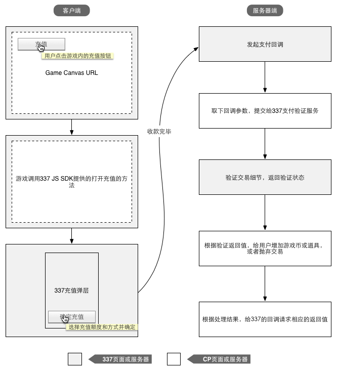

337平台对接规范
===============

.. _pre:

写在前面
-----------

ELEX方人员需要在337后台创建游戏并创建发布，双方需要约定请求密钥。下文中提到secret,
密钥时，在未特殊说明的情况下均为此请求密钥。密钥可以每个服务器一个，也可以所有服务器通用一个密钥。

游戏的每个服务器都有一个形如 **GameName@平台_语言_服编号**
的APPID。绝大部分时候，游戏不需要对这个APPID进行过多关注。只需了解337会给每个服一个标识就可以了，这个标识里有这个服的语言，平台，服编号等信息。

.. _login:

登录对接
-----------

CP需要为游戏的每个服务器提供一个 **Canvas URL** 用于接收平台传递给游戏的用户信息。

在加载此Canvas URL时，337平台会为其拼接上相关参数，以便开发者进行用户真实性验证。

参数介绍
^^^^^^^^^^
+------------------+---------+---------------+-----------------------------------------------------------------------------------------+
| 参数名           | 必须	| 变量类型      | 描述                                                                                    |
+==================+=========+===============+=========================================================================================+
| sig_app_id 	   | Y       | string        | 游戏发布的app id                                                                        |
+------------------+---------+---------------+-----------------------------------------------------------------------------------------+
| sig_api_key      | Y       | string        | 游戏发布的api key，通常情况下等同于`sig_app_id`参数                                     |
+------------------+---------+---------------+-----------------------------------------------------------------------------------------+
| sig_user         | Y       | string        | 用户uid                                                                                 |
+------------------+---------+---------------+-----------------------------------------------------------------------------------------+
| sig_username	   | Y	     | string        | 用户名，可作为用户创建角色时的默认角色名供用户选择                                      |
+------------------+---------+---------------+-----------------------------------------------------------------------------------------+
| sig_time         | Y	     | integer       | Unix时间戳, 游戏端最好对此做一个过期验证，比如距离当前时间戳超过5分钟的请求直接返回错误 |
+------------------+---------+---------------+-----------------------------------------------------------------------------------------+
| sig_flash_xml_url| N	     | string        | flash xml配置文件地址,无用则留空                                                        |
+------------------+---------+---------------+-----------------------------------------------------------------------------------------+
| sig_auth_key	   | Y       | string        | 参数验证签名                                                                            |
+------------------+---------+---------------+-----------------------------------------------------------------------------------------+
| sig_extended	   | N	     | string        | 参数描述见 :ref:`登陆接口扩展说明 <loginextend>` ,这个参数会独立签名，不参与登陆签名。  |
+------------------+---------+---------------+-----------------------------------------------------------------------------------------+

验证签名算法
^^^^^^^^^^^^^^

::

    sig_auth_key = MD5.encrypt(sig_user + sig_app_id + sig_api_key + sig_time + secret);

其中secret为双方约定的密钥，游戏方在验证通过后，有必要对 **sig_time** 做时间有效性判断。

例如，337在加载游戏页面的时候会同时加上上面所述参数：

::

    <iframe 
    id="iframecontent" scrolling="auto" frameborder="0" src="{游戏提供的URL}?sig_auth_key={sig_auth_key}&sig_user={sig_user}&sig_app_id={sig_app_id}&sig_api_key={sig_api_key}&sig_time={sig_time}&sig_username={sig_username}&sig_user_gender={sig_user_gender}&sig_src=&sig_flash_xml_url={sig_flash_xml}&connect_id={connect_id}" style="width:100%;">
    </iframe>

PHP代码示例：

::

    if(md5( $_GET[‘sig_user’] . $_GET[‘sig_app_id’] . $_GET[‘sig_api_key’] . $_GET[‘sig_time’] . $secret) !==  $_GET[‘sig_auth_key’]) {
        error_log(“Bad Signature”);
        return null;
    } else if((time() - (int)$_GET[‘sig_time’]) > 60 * 5) {
        // request should be issued in 5 minutes for example
        error_log(“Request Timeout”);
        return null;
    }

.. _loginextend:

登陆接口扩展说明
--------------------------------------

*此部分内容在接入过程中并非必要，目前仅供对接337平台VIP系统的游戏使用*

为了支持向游戏传递用户的VIP相关属性，337在加载游戏时，在传递既有参数的基础上，增加\ ``sig_extended``\ 参数，用于传递用户的VIP及其他扩展属性。

sig\_extended参数说明
^^^^^^^^^^^^^^^^^^^^^^^^

``sig_extended``\ 参数由\ ``payload``\ 数据及一个经过BASE64编码的\ ``sig``\ 字段组成，中间使用半角点号“.”连接。

Payload
~~~~~~~~~~~

``payload``\ 为经过json编码的字符串，包含待传递的VIP属性数据及其他扩展属性，其格式如：

::

    {   
        "issued_at": unix_timestamp,
        "algorithm": "HMAC-SHA256", 
        "uid": "elex337_1090912012",
        "vip": {
            "is_valid": 1,
            "is_annual": 1, 
            "level": 5,
            "point": 6310,
            "point_progress": 0.97185
        }
    }

+-------------------+---------------------------------------------------+
| 参数              | 说明                                              |
+===================+===================================================+
| issued\_at        | 请求发起的时间，为UNIX时间戳                      |
+-------------------+---------------------------------------------------+
| algorithm         | 签名算法，固定为HMAC-SHA256                       |
+-------------------+---------------------------------------------------+
| uid               | 用户UID，与sig\_user参数一致                      |
+-------------------+---------------------------------------------------+
| is\_valid         | 布尔值，是否有效VIP，1代表有效                    |
+-------------------+---------------------------------------------------+
| is\_annual        | 布尔值，是否年费VIP，1代表用户为年费VIP           |
+-------------------+---------------------------------------------------+
| level             | 用户VIP等级                                       |
+-------------------+---------------------------------------------------+
| point             | 用户VIP成长值                                     |
+-------------------+---------------------------------------------------+
| point\_progress   | 用户VIP成长值进度，即用户升级到下一级的进度比例   |
+-------------------+---------------------------------------------------+

sig
~~~~~~

对payload执行BASE64编码后，使用sha256作为签名算法，使用应用密钥作为签名密钥生成签名并对签名进行BASE64编码得到sig字段；

sig\_extended参数解析：
^^^^^^^^^^^^^^^^^^^^^^^

游戏在接收到\ ``sig_extended``\ 参数后，对其进行解析，验证其中包含的\ ``sig``\ 字段是否有效，并获取\ ``payload``\ 数据所包含的VIP属性。

``sig_extended``\ 参数解析流程如下：

1. 获取\ ``sig_extended``\ 中包含的\ ``sig``\ 及\ ``payload``\； 

2. 使用sha256算法及应用密钥对\ ``payload``\ 生成\ ``local sig``\； 

3. ``local sig``\ 与\ ``sig``\ 不相同时则\ ``sig_extended``\ 参数无效； 

4. ``local sig``\ 与\ ``sig``\ 相同时，对\ ``payload``\ 进行base64解码、JSON解码，获取其中包含的属性值;

5. 检查\ ``payload``\ 中包含的\ ``uid``\ 是否等于\ ``sig_user``\ 参数，以判断是否为当前登录用户；

6. 检查\ ``payload``\ 中的\ ``issued_at``\ 参数，判断时间是否过期； 

7. 上述检查通过之后，获取\ ``payload``\ 中包含的用户vip属性用于后续业务处理;

PHP解析示例：

::

    <?php
        $payload = parse_sig_extended($_REQUEST['sig_extended'], 'app_secret');
        // sig_extended参数解析算法
        function parse_sig_extended($sig_extended, $secret) {
            list($encoded_sig, $payload) = explode('.', $signed_request, 2);
            $sig = base64_decode($encoded_sig);
            $data = json_decode(base64_decode($payload), true);
            $expected_sig = hash_hmac('sha256', $payload, $secret, $raw = true)
            
            if ($sig !== $expected_sig) {
                // 检查sig是否有效
                error_log('sig error!');
                return null;
            }
            
            if(empty($data['uid'] || $data['uid'] !== $_GET['sig_user'] || time() - $data['issued_at'] > 3600) {
                // 检查是否为当前登录用户，及时间是否过期
                error_log('invalid parameter');
                return null;
            }
            return $data;
        }
    ?>

注意事项
^^^^^^^^^

1. ``sig_extended``\ 参数不参与\ ``sig_auth_key``\ 的生成,之前的登录验证方法不变；
2. ``sig_extended``\ 参数解析使用的密钥为337游戏发布对应的密钥；
3. 从安全性角度考虑，游戏需要对\ ``payload``\ 中的\ ``uid``\ ，\ ``issued_at``\ 等属性进行验证；

.. _payment:

支付对接
----------

客户端的集成
^^^^^^^^^^^^^

支付的前端部分需要游戏页面调用337的JS方法来打开337平台充值弹层，337平台通过JS SDK来解决此过程中的跨域问题。

JS SDK说明
~~~~~~~~~~~~

JS SDK
gdp\_jsproxy\_client2.1.js依赖于JQuery和Swfobject，http及https的地址分别如下：

HTTP地址：

-  http://elex\_p\_img337-f.akamaihd.net/static/js/jquery.min-1.4.2.js
-  http://elex\_p\_img337-f.akamaihd.net/static/js/swfobject.js
-  http://elex\_p\_img337-f.akamaihd.net/static/js/common/gdp\_jsproxy\_client2.1.js

HTTPS地址：

-  https://elex-i.akamaihd.net/platform.elex-tech.us/static/js/jquery.min-1.4.2.js
-  https://elex-i.akamaihd.net/platform.elex-tech.us/static/js/swfobject.js
-  https://elex-i.akamaihd.net/platform.elex-tech.us/static/js/common/gdp\_jsproxy\_client2.1.js

接口调用说明
~~~~~~~~~~~~~

在加载了JS
SDK之后，通过代理方法\ ``call_gdp_function(funcName, params, callback)``\ 调用337提供的JS API。

参数介绍
~~~~~~~~~~~

+------------+-----------------------------------------------------------+
| 参数       | 说明                                                      |
+============+===========================================================+
| funcName   | API名称（必需），打开支付面板时请传递\ ``showPayments``   |
+------------+-----------------------------------------------------------+
| params     | API参数（可选），为object类型                             |
+------------+-----------------------------------------------------------+
| Callback   | JS回调函数（可选）                                        |
+------------+-----------------------------------------------------------+

如果需要打开支付面板，示例代码如下:

::

    call_gdp_function("showPayments", {role_id: “玩家角色ID”});

服务器端的集成
^^^^^^^^^^^^^^

当用户完成付款之后，337平台需要将付款结果发送给CP，CP需要给用户账户增加相应的虚拟币或道具，并返回处理结果。

337后端支付的通知采用两次验证的方式，整个流程如下：

1. 337发起支付完成通知，带着一系列参数请求CP提供的支付回调接口
2. CP端收到调用请求，取下参数，将参数回传给337支付平台的验证服务
3. 337支付平台验证参数，返回验证结果
4. CP端收到验证结果，如果验证通过，则进行虚拟币和虚拟道具颁发工作。颁发完毕返回\ ``3,{用户的UID}``\ 告知337支付平台处理完毕。
5. 流程结束。

回调参数列表
~~~~~~~~~~~~~

+----------------+--------------------------------------------------------------------------+
| 参数           | 说明                                                                     |
+================+==========================================================================+
| trans\_id      | 唯一标示这次支付的订单号,重复单号不用处理                                |
+----------------+--------------------------------------------------------------------------+
| amount         | 用户购买游戏币数量，开发者需要给用户的游戏账户加上相应的数量。           |
+----------------+--------------------------------------------------------------------------+
| user\_id       | 购买发起的游戏用户标识，同登录时的sig\_user                              |
+----------------+--------------------------------------------------------------------------+
| role\_id       | 用户游戏角色的ID，适用于单服多角色的场景                                 |
+----------------+--------------------------------------------------------------------------+
| timestamp      | 请求时间戳，避免重复调用攻击                                             |
+----------------+--------------------------------------------------------------------------+
| gross          | 扣除渠道费用之前的交易金额                                               |
+----------------+--------------------------------------------------------------------------+
| currency       | 货币单位，例如:USD,EUR,BRL                                               |
+----------------+--------------------------------------------------------------------------+
| channel        | 支付渠道名称                                                             |
+----------------+--------------------------------------------------------------------------+
| pay\_type      | 支付类型，web/mobile, 用以区分支付来源是手机应用内充值还是其他充值方式   |
+----------------+--------------------------------------------------------------------------+
| vip            | 布尔值，用户是否享有了平台VIP折扣                                        |
+----------------+--------------------------------------------------------------------------+
| custom\_data   | 供CP和337自由定义的自定义参数，按照提交原样返回                          |
+----------------+--------------------------------------------------------------------------+

    -  ``gross``\ 只是作为参考使用，不作为对账依据。
    -  在某些支付渠道，337平台无法获得用户实际支付金额，所以\ ``gross``\ 参数可能为0。
    -  对于短信等费率超高的渠道，337平台会进行溢价，请不要以\ ``gross``\ 的值进行虚拟币计算，虚拟币数量请以\ ``amount``\ 参数为准。

参数验证
~~~~~~~~~~~

验证服务地址：https://pay.337.com/payelex/api/callback/verify.php

CA文件（PHP可能需要）：http://elexpublish.googlecode.com/files/verisign_ca.crt

接受请求方式：POST/GET

验证返回结果：

-  OK： 交易信息正确，请进行后续处理。
-  其他返回，交易信息错误，请放弃处理。

约定的返回值
~~~~~~~~~~~~

+--------------------------------------+------------------------+
| CP应当返回                           | 说明                   |
+======================================+========================+
| 3,null                               | 处理失败               |
+--------------------------------------+------------------------+
| 3,94a0acb127ef8ee8c925e3944941ce5e   | 处理失败，用户不存在   |
+--------------------------------------+------------------------+
| 3,$user\_id                          | 处理成功               |
+--------------------------------------+------------------------+

代码示例(PHP)
~~~~~~~~~~~~~~~

::

    <?php
    $trans_id = $_REQUEST ["trans_id"];
    $user_id = $_REQUEST ["user_id"];
    $amount = $_REQUEST['amount'];
    $gross = $_REQUEST['gross'];
    $currency = $_REQUEST['currency'];
    $channel = $_REQUEST['channel'];

    ob_clean();
    //To check if the transaction exists in db.
    //Yes means the transactions has been successfully processed. Just return OK status
    $exist = is_trans_exist($trans_id);
    if($exist) {
        echo '3,'.$user_id;
        return;
    }

    //to verify the transaction towards payelex server.
    $res = check_payelex_transaction($trans_id, $user_id, $amount, $gross, $currency, $channel);
    if(!$res) {
        echo "3,null";
        return;
    }

    //retrieve the user from db.
    $user = find_user_from_db();
    if ($user == null) {
        echo '3,94a0acb127ef8ee8c925e3944941ce5e';
        return;
    }

    //recharge the user with the deserved game coins.
    if(add_coins($_REQUEST)) {
        echo '3,'.$user_id;
        return;
    }

    echo "3,null";

    function check_payelex_transaction($trans_id, $user_id, $amount, $gross, $currency, $channel) {
        $ch = curl_init();
        curl_setopt($ch, CURLOPT_SSL_VERIFYPEER, true);
        curl_setopt($ch, CURLOPT_SSL_VERIFYHOST, 1);
        //verisign_ca.crt is the public certificate from
        //VeriSign(It is the biggest Certificate Authority which issue XingCloud client certificate)
        //verisign_ca.crt must be located at the same directory as this PHP code are.
        curl_setopt($ch, CURLOPT_CAINFO, 'verisign_ca.crt');
        curl_setopt($ch, CURLOPT_HTTPHEADER, array("Content-Type: application/x-www-form-urlencoded"));
        curl_setopt($ch, CURLOPT_URL, 'https://pay.337.com/payelex/api/callback/verify.php');
        curl_setopt($ch, CURLOPT_POST, true);
        curl_setopt($ch, CURLOPT_RETURNTRANSFER, true);
        
        $params = array(
                'trans_id'=>$trans_id,
                'user_id'=>$user_id,
                'amount'=>$amount,
                'gross'=>$gross,
                'currency'=>$currency,
                'channel'=>$channel
        );
        
        curl_setopt($ch, CURLOPT_POSTFIELDS, http_build_query($params));
        
        $result = curl_exec($ch);
        curl_close($ch);
        $result = trim($result);
        if ($result === 'OK') return true;
        return false;
    }

.. _roleinfoquery:

用户角色查询接口(CP提供)
--------------------------

*非必须，337会通过这个接口查询用户在某个游戏某个服里的信息，以提供更好的用户体验和其他基于用户角色信息的增值服务*

请求方式
^^^^^^^^^

GET

参数列表
^^^^^^^^^^^

+------------------+--------+------------+-----------------------------------------------------------------+
| 参数名           | 必须   | 变量类型   | 描述                                                            |
+==================+========+============+=================================================================+
| sig\_user        | Y      | string     | 待查询用户的uid                                                 |
+------------------+--------+------------+-----------------------------------------------------------------+
| sig\_app\_id     | Y      | string     | 待查询游戏服的标识                                              |
+------------------+--------+------------+-----------------------------------------------------------------+
| sig\_api\_key    | Y      | string     | 待查询游戏服的api key，通常情况下等同于\ ``sig_app_id``\ 参数   |
+------------------+--------+------------+-----------------------------------------------------------------+
| sig\_auth\_key   | Y      | string     | 请求的签名，游戏据此验证请求是否合法。                          |
+------------------+--------+------------+-----------------------------------------------------------------+

返回结果
^^^^^^^^^^^^

**请求成功**\ ：以json格式返回角色的ID、名称、等级等属性：

::

    [
        {“role_id”: “1000909012”,“role_name”:”rolename”,”level”:”9”}, 
        {“role_id”: “1000909013”,“role_name”:”rolename2”,”level”:”39”}, 
        ...
    ]；

**请求错误**\ ：返回错误的信息，如 ``{“error”:”sig error”}`` 表示签名错误；

**无数据**\ ：输出空。

签名算法
^^^^^^^^^^

本接口采用md5算法对请求进行签名，签名的字符串为\ ``sig_user``\ ，\ ``sig_app_id``, ``sig_api_key``\ 及应用密钥的连接串，如

::

    $sig_auth_key = md5($sig_user . $sig_app_id. $sig_api_key . $secret_key)

游戏需要据此验证\ ``sig_auth_key``\ 参数，判断请求是否合法。

.. _sendprize:

发奖接口(CP提供)
-----------------

*非必须，此接口供平台提供增值服务时，通知游戏为某位用户增加奖励道具使用*

请求方式
^^^^^^^^^^^

GET/POST, 请两种方式都做支持。

参数列表
^^^^^^^^^^^^

+--------------+--------+------------+----------------------------------------------------+
| 参数名       | 必须   | 变量类型   | 描述                                               |
+==============+========+============+====================================================+
| reward\_id   | Y      | string     | 本次奖励发放的序列号                               |
+--------------+--------+------------+----------------------------------------------------+
| amount       | Y      | integer    | 奖品数量                                           |
+--------------+--------+------------+----------------------------------------------------+
| user\_id     | Y      | string     | 用户的平台UID                                      |
+--------------+--------+------------+----------------------------------------------------+
| timestamp    | Y      | integer    | 请求时间，为unix时间戳                             |
+--------------+--------+------------+----------------------------------------------------+
| item\_id     | Y      | string     | 奖励物品的ID，由CP提供                             |
+--------------+--------+------------+----------------------------------------------------+
| role\_id     | Y      | string     | 用户的角色ID，供单服一个用户有多个角色的场景使用   |
+--------------+--------+------------+----------------------------------------------------+
| sign         | Y      | string     | 请求签名                                           |
+--------------+--------+------------+----------------------------------------------------+

返回结果
^^^^^^^^^^^

返回值为包含 ``status``\ 、\ ``data``\ 、\ ``message``\ 的数组结构

-  **status**: 为0表示成功，其他数字均表示失败。
-  **data**: 用于存放成功时返回的数据
-  **message**: 用户存放失败时的错误消息

例如:

-  成功：\ ``{"status":0,"data":""}``
-  失败：\ ``{"status":1,"message":"bad sig"}``

签名规则
^^^^^^^^^^^

除\ ``sign``\ 参数外的参数按照字典顺序排序，并对其值进行拼合，计算md5值。

例：

请求数组(如下)，密钥1234567890

::

    Array
    (
        [reward_id] => 136209600051460001
        [amount] => 10
        [user_id] => 100000344040951
        [timestamp] => 1362720000
        [item_id] => 3203854
        [role_id] => whatever
        [sign] => 6cc19e705e5e59574755dc0a6818bbb6
    )

排序后为

::

    Array
    (
        [amount] => 10
        [item_id] => 3203854
        [reward_id] => 136209600051460001
        [role_id] => whatever
        [sign] => 6cc19e705e5e59574755dc0a6818bbb6
        [timestamp] => 1362720000
        [user_id] => 100000344040951
    )

value与密钥拼接成字符串并求其MD5值：

::

    103203854136209600051460001whatever13627200001000003440409511234567890

    Md5 = 6cc19e705e5e59574755dc0a6818bbb6
